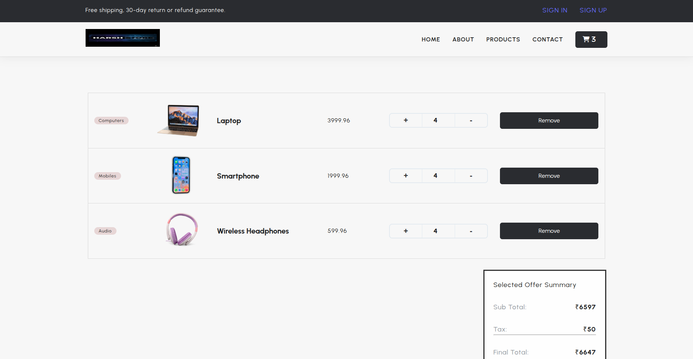
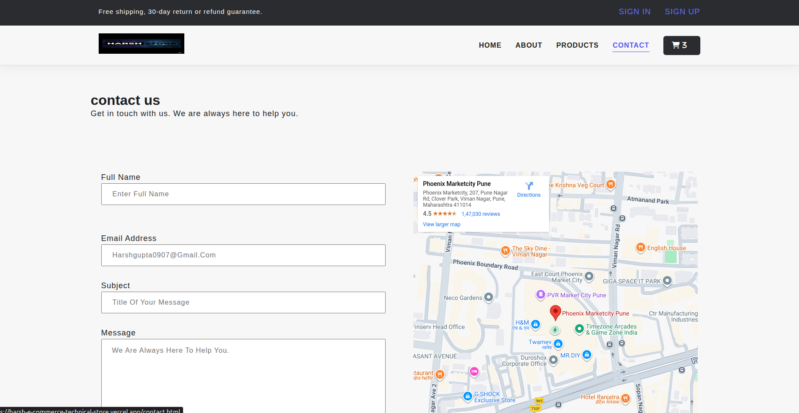

# 🛒 Harsh Technical Store

Harsh Technical Store is a **basic E-commerce website** built using **HTML, CSS, and JavaScript**, bundled and served with **Vite**.  
The project focuses on core frontend concepts such as DOM manipulation, cart logic, local storage usage, and multi-page navigation without using any frameworks.

🚀 **Live Demo:**  
👉 https://harsh-e-commerce-technical-store-m5.vercel.app

---


---

## 📸 Screenshots

### 🏠 Home Page


### 🛍️ Products Page


### 🛒 Cart Page


### 📩 Contact Page


---

## ✨ Features

- 🏠 Multiple pages: **Home, About, Products, Contact**
- 🛍️ Product listing with quantity control
- ➕ Add products to cart
- ➖ Increase / decrease product quantity
- 🛒 Cart page with:
  - Added products
  - Quantity handling
  - Total price calculation
- 💾 **Local Storage** used for cart persistence
- 📩 Contact form
- 🗺️ Google Maps integration
- ⚡ Fast development & build using **Vite**

---

## 🛠️ Tech Stack

- **HTML** – Structure
- **CSS** – Styling
- **JavaScript (Vanilla)** – Logic & Interactivity
- **Local Storage** – Cart data persistence
- **Vite** – Development server & build tool
- **Vercel** – Deployment

---

## 📂 Project Structure

```text
├── api/
├── dist/                    # Production build (generated)
├── node_modules/
├── public/                  # Static assets
│   └── images/
├── about.html
├── addToCart.html
├── contact.html
├── products.html
├── index.html
├── style.css
├── main.js
├── addToCart.js
├── fetchQuantityFromCart.js
├── footer.js
├── getCartProducts.js
├── homeProductCards.js
├── homeQuantityToggle.js
├── incrementDecrement.js
├── removeProdFromCart.js
├── showAddToCartCards.js
├── showToast.js
├── updateCartProductTotal.js
├── updateCartValue.js
├── package.json
├── package-lock.json
├── vite.config.js
└── README.md
